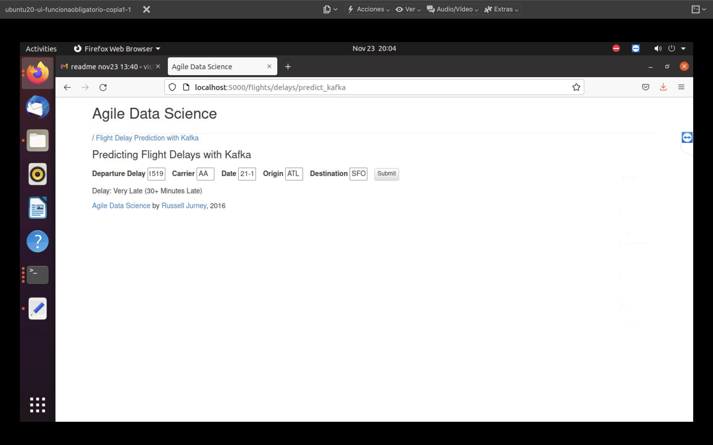
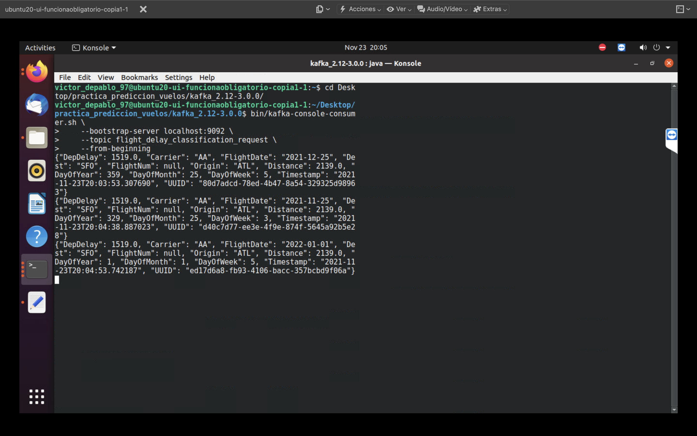
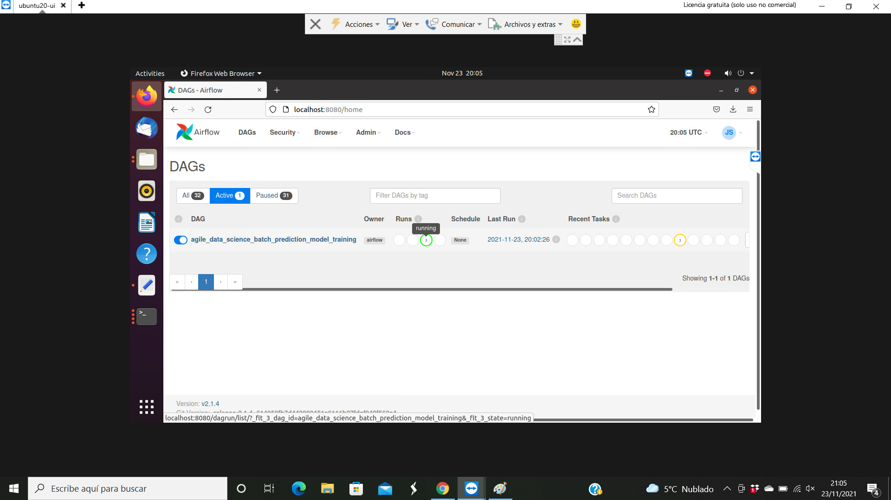
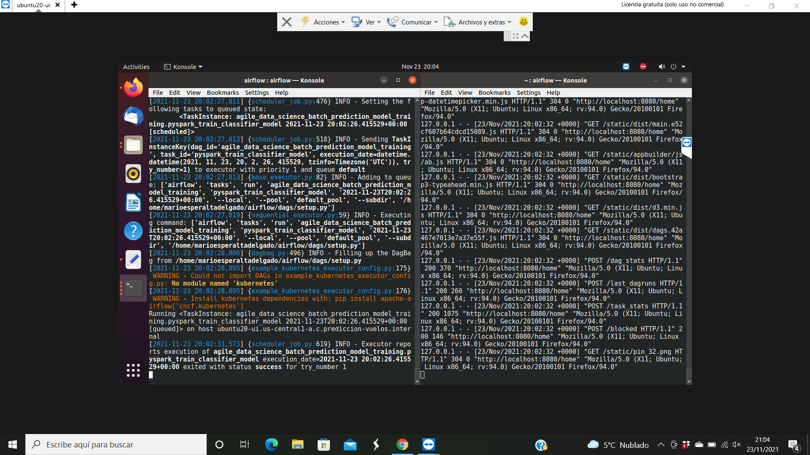
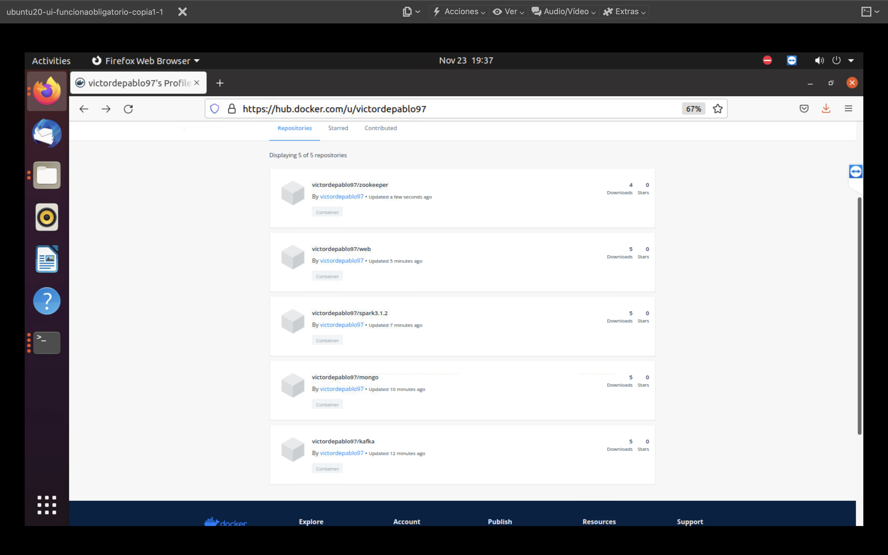

# DESPLIEGUE PRÁCTICA PREDICCIÓN DE VUELOS BIG DATA

# Autores: Mario Esperalta Delgado y Víctor de Pablo Gozalo. Versión Ubuntu 20.04

## 0. Configurar entorno Ubuntu y clonar repositorio GitHub inicial.
```
sudo apt-get update
```

### 0.1 Instalar varios terminales de comandos por si falla el terminal por defecto
```
sudo apt-get install xterm
sudo apt-get install terminator -y
sudo apt-get install konsole -y
sudo apt-get install tilda -y
sudo apt-get install rxvt -y
sudo apt-get install lilyterm
sudo apt-get install sakura
```

### 0.2 Instalar y configurar git para clonar repositorio GitHub.
```
sudo apt install git
sudo git config --global user.name "NOMBRE DE USUARIO GITHUB"
sudo git config --global user.email "CORREO CUENTA GITHUB"
```

Para ver que se ha guardado correctamente: `sudo git config --list`

```
cd Desktop
mkdir practica_prediccion_vuelos
cd practica_prediccion_vuelos
git clone https://github.com/ging/practica_big_data_2019
```

### 0.3 Descargar datos necesarios de vuelos pasados
```
cd practica_big_data_2019/
resources/download_data.sh
```

## 1 Instalación herramientas necesarias y componentes de la arquitectura
```
sudo apt-get update
```

### 1.1 Instalación de curl
```
sudo apt install curl
```

### 1.2 Instalación Java 1.8.0
```
sudo apt install openjdk-8-jdk -y
```

Asegurarse que las versiones de Java y Javac son la 1.8 con: `java -version` y `javac -version`

### 1.3 Instalación Python 3.7 y pip asociado a esa versión de python
```
sudo apt install software-properties-common
sudo add-apt-repository ppa:deadsnakes/ppa #Pulsar enter
sudo apt install python3.7 -y
sudo apt-get install python3-pip -y
sudo update-alternatives --install /usr/bin/python3 python3 /usr/bin/python3.7 1
```

Chequear versiones con: `python3.7 --version` y `pip --version`

### 1.4 Instalación de sbt
```
echo "deb https://repo.scala-sbt.org/scalasbt/debian all main" | sudo tee /etc/apt/sources.list.d/sbt.list
echo "deb https://repo.scala-sbt.org/scalasbt/debian /" | sudo tee /etc/apt/sources.list.d/sbt_old.list
curl -sL "https://keyserver.ubuntu.com/pks/lookup?op=get&search=0x2EE0EA64E40A89B84B2DF73499E82A75642AC823" | sudo apt-key add
sudo apt-get install sbt
```

Chequear versiones con el comando: `sbt -version`. En este caso, se trabaja con la version 1.5.5

### 1.5 Instalación de MongoDB 4.2 version Community
```
wget -qO - https://www.mongodb.org/static/pgp/server-4.2.asc | sudo apt-key add -
echo "deb [ arch=amd64,arm64 ] https://repo.mongodb.org/apt/ubuntu bionic/mongodb-org/4.2 multiverse" | sudo tee /etc/apt/sources.list.d/mongodb-org-4.2.list
sudo apt-get install -y mongodb-org
echo "mongodb-org hold" | sudo dpkg --set-selections
echo "mongodb-org-server hold" | sudo dpkg --set-selections
echo "mongodb-org-shell hold" | sudo dpkg --set-selections
echo "mongodb-org-mongos hold" | sudo dpkg --set-selections
echo "mongodb-org-tools hold" | sudo dpkg --set-selections
```

Chequear versiones con el comando: `mongod --version`. En este caso, se trabaja con la version 4.2.17

Comprobar el sistema init que la plataforma mongo usa con el comando: `ps --no-headers -o comm 1`. El sistema usa "systemd" (se empleará más adelante para arrancar mongo)

### 1.6 Instalación de Spark 3.1.2
```
cd ..
wget https://dlcdn.apache.org/spark/spark-3.1.2/spark-3.1.2-bin-hadoop3.2.tgz
tar -xvf spark-3.1.2-bin-hadoop3.2.tgz
rm spark-3.1.2-bin-hadoop3.2.tgz
```

Se mueve al directorio opt
```
sudo mv spark-3.1.2-bin-hadoop3.2/ /opt/spark
```

### 1.7 Instalación de Scala 2.12
```
curl -s "https://get.sdkman.io" | bash
source "/home/NOMBRE_USUARIO_UBUNTU/.sdkman/bin/sdkman-init.sh"
sdk install scala 2.12.1
```

Chequear versiones con el comando `scala -version`. 

### 1.8 Instalación de Zookeeper 3.7.0
```
wget https://dlcdn.apache.org/zookeeper/zookeeper-3.7.0/apache-zookeeper-3.7.0-bin.tar.gz
tar -xvf apache-zookeeper-3.7.0-bin.tar.gz
rm apache-zookeeper-3.7.0-bin.tar.gz
```

### 1.9 Instalación de Kafka 2.12-3.0.0
```
wget https://dlcdn.apache.org/kafka/3.0.0/kafka_2.12-3.0.0.tgz
tar -xvf kafka_2.12-3.0.0.tgz
rm kafka_2.12-3.0.0.tgz
```

### 1.10 Instalación de librerías Python necesarias para el proyecto
```
cd practica_big_data_2019/
pip install -r requirements.txt
pip3 install -r requirements.txt
pip3 install Pillow
```

## 2. Arrancar componentes de la arquitectura
```
sudo apt update
```

### 2.1 Arrancar Zookeeper
Abrir un nuevo terminal y moverse al escritorio de Kafka
```
cd Desktop/practica_prediccion_vuelos/kafka_2.12-3.0.0/
sudo bin/zookeeper-server-start.sh config/zookeeper.properties
```

### 2.2 Arrancar Kafka
Abrir un nueva terminal
Moverse al directorio Kafka
```
cd Desktop/practica_prediccion_vuelos/kafka_2.12-3.0.0/
sudo bin/kafka-server-start.sh config/server.properties
```

Abrir un nuevo terminal y, en el mismo directorio kafka, crear un nuevo topic
```
cd Desktop/practica_prediccion_vuelos/kafka_2.12-3.0.0/
    bin/kafka-topics.sh \
      --create \
      --bootstrap-server localhost:9092 \
      --replication-factor 1 \
      --partitions 1 \
      --topic flight_delay_classification_request
```

Aparece el siguiente mensaje por pantalla: `Created topic flight_delay_classification_request.`

Para ver la lista de topics creados: `bin/kafka-topics.sh --bootstrap-server localhost:9092 --list`

Devuelve como salida el nombre del único topic creado: `flight_delay_classification_request`

Abrir un nuevo terminal y, en el mismo directorio kafka, crear un nuevo consumidor
```
cd Desktop/practica_prediccion_vuelos/kafka_2.12-3.0.0/
bin/kafka-console-consumer.sh \
    --bootstrap-server localhost:9092 \
    --topic flight_delay_classification_request \
    --from-beginning
```

### 2.3 Arrancar Mongo
Abrir un nuevo terminal
```
sudo systemctl start mongod
```
Para ver que está activo: `sudo systemctl status mongod`. Salir con Ctrl+C.
Para parar Mongo: `sudo systemctl stop mongod`

### 2.4 Arrancar Spark
Abrir un nuevo terminal y comprobar directorio de ubicación de java con: `ls /usr/lib/jvm/java*`
```
export JAVA_HOME=/usr/lib/jvm/java-1.8.0-openjdk-amd64
cd Desktop/practica_prediccion_vuelos/practica_big_data_2019/
export SPARK_HOME=/opt/spark
cd /opt/spark/sbin/
sudo ./start-master.sh
```

## 3. Importar el registro de distancias de vuelos a MongoDB
Abrir un nuevo terminal
```
cd Desktop/practica_prediccion_vuelos/practica_big_data_2019/
sudo ./resources/import_distances.sh
```

## 4. Entrenar el modelo con PySpark mllib
```
python3.7 resources/train_spark_mllib_model.py .
```
Deben de aparecer varios ficheros en `../models`

## 5. Ejecutar el predictor de vuelos
```
cd flight_prediction/
sbt
```

Para usar spark-submit hay que compilar el código
```
compile
```

Para construir un fichero jar usando sbt se ejecuta el siguiente comando
```
package
exit
```

Se tienen que añadir al menos estos dos paquetes con la opción --package
```
/opt/spark/bin/spark-submit --class es.upm.dit.ging.predictor.MakePrediction --packages org.mongodb.spark:mongo-spark-connector_2.12:3.0.1,org.apache.spark:spark-sql-kafka-0-10_2.12:3.1.2 /home/NOMBRE_USUARIO_UBUNTU/Desktop/practica_prediccion_vuelos/practica_big_data_2019/flight_prediction/target/scala-2.12/flight_prediction_2.12-0.1.jar
```
### SALDRÁN ERRORES. SE SOLUCIONAN MEDIANTE:
Abrir un nuevo terminal
```
sudo su
cd /
mkdir Users
cd Users
mkdir admin
cd admin
mkdir IdeaProjects
cd IdeaProjects
mkdir ging
cd ging
mkdir practica_big_data_2019
cd practica_big_data_2019
mkdir models
cd models
```

Se vuelve al terminal donde se ha ejecutado spark-submit
```
cd ..
cd models
sudo su
cp -r arrival_bucketizer_2.0.bin/ /Users/admin/IdeaProjects/ging/practica_big_data_2019/models/arrival_bucketizer_2.0.bin
cp -r string_indexer_model_Carrier.bin/ /Users/admin/IdeaProjects/ging/practica_big_data_2019/models/string_indexer_model_Carrier.bin
cp -r string_indexer_model_Origin.bin/ /Users/admin/IdeaProjects/ging/practica_big_data_2019/models/string_indexer_model_Origin.bin
cp -r string_indexer_model_Dest.bin/ /Users/admin/IdeaProjects/ging/practica_big_data_2019/models/string_indexer_model_Dest.bin
cp -r string_indexer_model_Route.bin/ /Users/admin/IdeaProjects/ging/practica_big_data_2019/models/string_indexer_model_Route.bin
cp -r numeric_vector_assembler.bin/ /Users/admin/IdeaProjects/ging/practica_big_data_2019/models/numeric_vector_assembler.bin
cp -r spark_random_forest_classifier.flight_delays.5.0.bin/ /Users/admin/IdeaProjects/ging/practica_big_data_2019/models/spark_random_forest_classifier.flight_delays.5.0.bin
```

Presionar las teclas `Ctrl+D` para salir del modo root.
Hay que volver al terminal donde se han copiado los modelos, verificando que se han copiado, y se sale del modo root.
Posteriormente, hay que volver al terminal donde previamente se ejecutó spark-submit, sin tener exito, y volver a correr el comando
```
/opt/spark/bin/spark-submit --class es.upm.dit.ging.predictor.MakePrediction --packages org.mongodb.spark:mongo-spark-connector_2.12:3.0.1,org.apache.spark:spark-sql-kafka-0-10_2.12:3.1.2 /home/NOMBRE_USUARIO_UBUNTU/Desktop/practica_prediccion_vuelos/practica_big_data_2019/flight_prediction/target/scala-2.12/flight_prediction_2.12-0.1.jar
```

## 6. Arrancar aplicacion web para peticion de prediccion de vuelos
Abrir un nuevo terminal
```
cd Desktop/practica_prediccion_vuelos/practica_big_data_2019/
export PROJECT_HOME=/home/NOMBRE_USUARIO_UBUNTU/Desktop/practica_prediccion_vuelos/practica_big_data_2019
cd resources
cd web
python3.7 predict_flask.py
```

## 7. Abrir firefox

`http://localhost:5000/flights/delays/predict_kafka`





Control+Shift+J


# En sucesivas ocasiones que se quiera probar el predictor de vuelos con la máquina virtual ubuntu recién arrancada, sólo es necesaria la ejecución de los siguientes comandos:

## 0. Arrancar Zookeeper
Abrir un nuevo terminal y moverse al escritorio de Kafka
```
cd Desktop/practica_prediccion_vuelos/kafka_2.12-3.0.0/
sudo bin/zookeeper-server-start.sh config/zookeeper.properties
```

## 1. Arrancar Kafka
Abrir un nueva terminal y moverse al directorio Kafka
```
cd Desktop/practica_prediccion_vuelos/kafka_2.12-3.0.0/
sudo bin/kafka-server-start.sh config/server.properties
```

Abrir un nuevo terminal y, en el mismo directorio kafka, crear un nuevo topic
```
cd Desktop/practica_prediccion_vuelos/kafka_2.12-3.0.0/
    bin/kafka-topics.sh \
      --create \
      --bootstrap-server localhost:9092 \
      --replication-factor 1 \
      --partitions 1 \
      --topic flight_delay_classification_request
```

Abrir un nuevo terminal y, en el mismo directorio kafka, crear un nuevo consumidor
```
cd Desktop/practica_prediccion_vuelos/kafka_2.12-3.0.0/
bin/kafka-console-consumer.sh \
    --bootstrap-server localhost:9092 \
    --topic flight_delay_classification_request \
    --from-beginning
```

## 2. Arrancar Mongo
Abrir un nuevo terminal
```
sudo systemctl start mongod
```

Para ver que está activo: `sudo systemctl status mongod`. Salir con `Ctrl+C`

## 3 Arrancar Spark
Abrir un nuevo terminal
```
cd /opt/spark/sbin/
sudo ./start-master.sh
```

## 4. Ejecutar el predictor de vuelos con spark-submit
```
/opt/spark/bin/spark-submit --class es.upm.dit.ging.predictor.MakePrediction --packages org.mongodb.spark:mongo-spark-connector_2.12:3.0.1,org.apache.spark:spark-sql-kafka-0-10_2.12:3.1.2 /home/NOMBRE_USUARIO_UBUNTU/Desktop/practica_prediccion_vuelos/practica_big_data_2019/flight_prediction/target/scala-2.12/flight_prediction_2.12-0.1.jar
```

## 5. Arrancar aplicacion web para petición de prediccion de vuelos
Abrir un nuevo terminal
```
cd Desktop/practica_prediccion_vuelos/practica_big_data_2019/
export PROJECT_HOME=/home/NOMBRE_USUARIO_UBUNTU/Desktop/practica_prediccion_vuelos/practica_big_data_2019
cd resources
cd web
python3.7 predict_flask.py
```

## 6. Abrimos firefox

`http://localhost:5000/flights/delays/predict_kafka`

Control+Shift+J

# MEJORAS

## Mejora "Desplegar el escenario completo en Google Cloud"
## Se ha creado una instancia de la VM ubuntu 20.04 en Google Cloud con interfaz gráfica. 
Para ello se ha seguido la guía: `https://youtu.be/OyxwQQArHdM`

### Primer paso. Se ha creado el escenario completo desplegando el predictor de vuelos con spark-submit como se ha hecho previamente con una máquina virtual ubuntu 20.04 en VirtualBox.

### Segundo Paso. Se ha probado el escenario completo entrenando el modelo con Apache Airflow.

### Tercer Paso. Se ha intentado desplegar el predictor de retraso de vuelos a través de contenedores Docker no teniendo éxito. El contenedor de Spark falla al ejecutar el comando que corre el spark-submit. 


## Mejora "TRAIN THE MODEL WITH APACHE AIRFLOW"
## 0. Arrancar Zookeeper, Kafka, un productor, un consumidor y mongo como en la parte obligatoria de la práctica

## 1. Instalar librerías python para Apache Airflow
Abrir un nuevo terminal
```
cd Desktop/practica_prediccion_vuelos/practica_big_data_2019/resources/airflow
pip3 install -r requirements.txt -c constraints.txt
pip install -r requirements.txt -c constraints.txt
```

## 2. Configuración variables del entorno PROJECT_HOME y PATH
```
export PROJECT_HOME=/home/NOMBRE_USUARIO_UBUNTU/Desktop/practica_prediccion_vuelos/practica_big_data_2019
export PATH=$PATH:/opt/spark/bin
```

## 3. Configuración del entorno airflow
```
export AIRFLOW_HOME=~/airflow
mkdir $AIRFLOW_HOME
cd $AIRFLOW_HOME
mkdir dags
mkdir logs
mkdir plugins
cd ..
cd Desktop/practica_prediccion_vuelos/practica_big_data_2019/resources/airflow/
airflow users create \
    --username admin \
    --firstname Jack \
    --lastname  Sparrow\
    --role Admin \
    --email example@mail.org
airflow db init
```

## 4. Añadir el DAG
```
cp ~/Desktop/practica_prediccion_vuelos/practica_big_data_2019/resources/airflow/setup.py ~/airflow/dags
```

## 5. Arracar airflow scheduler y webserver
```
airflow webserver --port 8080
#Accedemos a la interfaz gráfica de Apache Airflow http://localhost:8080/home
airflow scheduler
```






## Mejora "Dockerizar cada uno de los servicios que componen la arquitectura completa" - INCOMPLETO

## 0. Instalación de Docker
La instalación se ha llevado a cabo siguiendo la guía: 
`https://docs.docker.com/engine/install/ubuntu/#install-using-the-repository`

```
sudo apt-get remove docker docker-engine docker.io containerd runc
sudo apt-get update
sudo apt-get install \
    ca-certificates \
    curl \
    gnupg \
    lsb-release
curl -fsSL https://download.docker.com/linux/ubuntu/gpg | sudo gpg --dearmor -o /usr/share/keyrings/docker-archive-keyring.gpg
echo \
  "deb [arch=$(dpkg --print-architecture) signed-by=/usr/share/keyrings/docker-archive-keyring.gpg] https://download.docker.com/linux/ubuntu \
  $(lsb_release -cs) stable" | sudo tee /etc/apt/sources.list.d/docker.list > /dev/null
sudo apt-get update
sudo apt-get install docker-ce docker-ce-cli containerd.io
sudo docker run hello-world
```

## 1. Instalación de Docker Compose

La instalación se ha llevado a cabo siguiendo la guía: `https://www.digitalocean.com/community/tutorials/how-to-install-and-use-docker-compose-on-ubuntu-20-04-es`

```
sudo curl -L "https://github.com/docker/compose/releases/download/1.27.4/docker-compose-$(uname -s)-$(uname -m)" -o /usr/local/bin/docker-compose
```

## 2. Implementación de un DockerFile por cada uno de los componentes de la arquitectura.
Se han implementado cinco Dockerfile correspondientes a los componentes Zookeeper, Kafka, Mongo, Spark y web que contienen todas las herramientas complementarias para su ejecución.
Las imágenes construidas a partir de los Dockerfile han sido subidas a nuestra cuenta personal en Dockerhub y se puede acceder a ellas a través del siguiente enlace: `https://hub.docker.com/u/victordepablo97`



La descripción de los Dockerfile se encuentra dentro de nuestro repositorio: `despliegue_practica_bigdata_2021` en la ruta `resources/Dockerizar_pruebas`

## 3. Compilar Dockerfile, arrancar contenedores a partir de las imágenes creadas y pruebas.
Se abre un nuevo terminal
```
cd Desktop/practica_prediccion_vuelos/practica_big_data_2019/resources/Dockerizar_pruebas/
```

### 3.1 Zookeeper
```
cd Zookeeper
sudo docker build -t victordepablo97/zookeeper:3.7 .
sudo docker run -d --name zoo1 -p 2600:2600 victordepablo97/zookeeper:3.7 bash -c 'yum install -y httpd && apachectl -D FOREGROUND'
sudo docker exec -it a47a /bin/bash
bin/zkServer.sh start /usr/bin/java
```

### 3.2 Kafka
Se ejecutan 3 contenedores de la misma imagen para arrancar kafka, crear un productor y crear un consumidor
```
cd ..
cd kafka
chmod 755 start.sh
sudo docker build . -t kafka:3.0.0
sudo docker run -d --name kafka-broker kafka:3.0.0
sudo docker run --rm -it --link kafka-broker --name temp kafka:3.0.0 bin/kafka-topics.sh --create --bootstrap-server kafka-broker:9092 --replication-factor 1 --partitions 1 --topic flight_delay_classification_request
sudo docker run --rm -it --link kafka-broker --name producer kafka:3.0.0 bin/kafka-console-producer.sh --bootstrap-server kafka-broker:9092 --topic flight_delay_classification_request
```

Abrir un nuevo terminal
```
sudo docker run --rm -it --link kafka-broker --name consumer kafka:3.0.0 bin/kafka-console-consumer.sh --bootstrap-server kafka-broker:9092 --topic flight_delay_classification_request --from-beginning
```

### 3.3 Mongo
```
cd ..
cd Mongo
sudo docker build -t victordepablo97/mongo:4.2 .
sudo docker run -d -p 27017:27017 --name=database mongo:4.2
sudo docker start mongo:4.2
sudo docker exec -it database bash
```

### 3.4 Spark
```
cd ..
cd Spark
sudo docker build -t victordepablo97/spark:3.1.2 .
sudo docker run -d --name spark -p 7077:7077 victordepablo97/spark:3.1.2
```

### DA FALLO AL EJECUTAR EL ÚLTIMO PASO DEL DOCKERFILE (SPARK-SUBMIT)

### 3.5 Web
```
cd ..
cd Web
Abrir un nuevo terminal
sudo docker build -t victordepablo97/web .
sudo docker run -d --name web victordepablo97/web
```

## 4. Puede ser que se construyan imágenes y contenedores que se desean parar y eliminar por no coincidir las versiones o haber escrito erróneamente el comando build o run. Algunas soluciones pueden ser:

Ver imagenes docker creadas
```
sudo docker images
```

Ver contenedores docker inactivos
```
sudo docker ps -a
```

Ver contenedores docker activos
```
sudo docker ps
```

Parar un contenedor
```
sudo docker stop "PRIMEROS DIGITOS DEL IDENTICADOR DEL CONTENEDOR"
```

Eliminar todos los contenedores inactivos
```
sudo su
sudo docker rm $(docker ps -a -q)
```
Para salir del modo superusuario: `Ctrl + D`


Borrar una imagen
```
sudo docker rmi "USUARIO_DOCKER/NOMBRE_IMAGEN:ETIQUETA"
```

Borrar todas las imagenes
```
sudo su
sudo docker rm $(docker images)
```
Para salir del modo superusuario: `Ctrl + D`

## 5. Subir las imágenes Docker creadas a Dockerhub
### 5.1 Iniciar sesión en Dockerhub por linea de comandos
```
sudo docker login
```

### 5.2 Preparar la imagen para que sea aceptada en este registro publico
```
sudo docker tag NOMBRE_IMAGEN USUARIO_DOCKER/NOMBRE_IMAGEN:ETIQUETA
```

### 5.3 Usar comando push para subir la imagen
```
sudo docker push USUARIO_DOCKER/NOMBRE_IMAGEN:ETIQUETA
```

### 5.4 Subida de las imágenes que dockerizan los servicios implementados en la arquitectura para desplegar el predictor de vuelos
```
sudo docker tag victordepablo97/zookeeper:3.7 victordepablo97/zookeeper:3.7
sudo docker push victordepablo97/zookeeper:3.7
sudo docker tag victordepablo97/kafka:3.0.0 victordepablo97/kafka:3.0.0
sudo docker push victordepablo97/kafka:3.0.0
sudo docker tag victordepablo97/mongo:4.2 victordepablo97/mongo:4.2
sudo docker push victordepablo97/mongo:4.2
sudo docker tag victordepablo97/spark:3.1.2 victordepablo97/spark3.1.2
sudo docker push victordepablo97/spark3.1.2
sudo docker tag victordepablo97/web victordepablo97/web
sudo docker push victordepablo97/web
```


